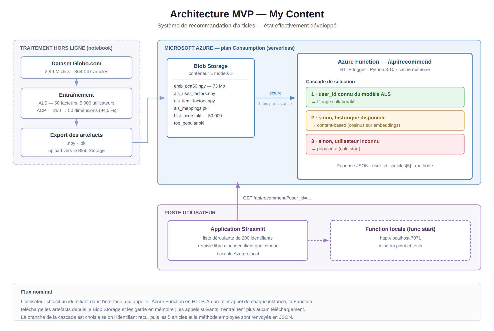
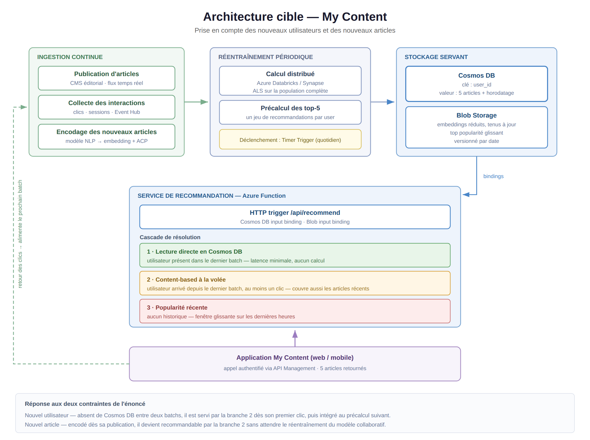

# Système de recommandation d'articles (My Content)

MVP d'un système de recommandation d'articles de presse, déployé en architecture serverless sur Azure Functions.

Le besoin fonctionnel tient en une phrase : *en tant qu'utilisateur de l'application, je reçois une sélection de cinq articles.* L'ensemble du projet est construit autour de cette user story, avec une contrainte structurante : l'architecture doit absorber l'arrivée de nouveaux utilisateurs et de nouveaux articles.

---

## Données

Jeu de données [Globo.com, news portal user interactions](https://www.kaggle.com/datasets/gspmoreira/news-portal-user-interactions-by-globocom), non versionné dans ce dépôt.

| | |
|---|---|
| Articles au catalogue | 364 047 |
| Interactions | 2 988 181 |
| Utilisateurs | 322 897 |
| Embeddings fournis | 364 047 × 250 (float32, 364 Mo) |

### Constats qui orientent les choix techniques

**Période exploitable : 1er au 16 octobre 2017.** Le volume d'interactions chute de plus de 99 % à partir du 17 octobre, passant de 190 000 clics quotidiens à quelques dizaines. Les interactions résiduelles proviennent à 96 % d'utilisateurs déjà observés, ce qui traduit un changement de périmètre de collecte plutôt qu'une évolution du comportement. La période retenue exclut cette portion.

**Historique très court.** Médiane de 4 clics par utilisateur, premier quartile à 2. La distribution est fortement asymétrique (moyenne 9,25, maximum 1232) : une minorité d'utilisateurs très actifs coexiste avec une masse de visiteurs occasionnels. Le filtrage collaboratif dispose donc de peu de signal pour la majorité de la population.

**Catalogue largement inexploré.** 46 033 articles ont été cliqués au moins une fois, soit 12,6 % du catalogue. Près de 9 articles sur 10 sont invisibles pour un modèle collaboratif, quel que soit son entraînement. Seule une approche par le contenu peut les faire remonter.

**Cold start mesuré.** Sur un découpage temporel au 14 octobre, 20,6 % des utilisateurs actifs en test (19 771 sur 95 773) n'apparaissent pas dans la période d'entraînement. Le cas du nouvel utilisateur n'est pas théorique : il concerne un utilisateur sur cinq.

---

## Modèles

### Content-based filtering

Le profil d'un utilisateur est la moyenne des embeddings des articles qu'il a consultés. La recommandation retient les cinq articles du catalogue dont la similarité cosinus avec ce profil est la plus forte, en excluant ceux déjà lus.

Deux stratégies de construction du profil ont été comparées :

- **moyenne des embeddings** (retenue) : agrège plusieurs centres d'intérêt et produit des recommandations plus diversifiées ;
- **dernier article consulté** : capte mieux l'intention immédiate, mais ramène le voisinage direct d'un seul article et enferme thématiquement.

Le recouvrement de catégories entre articles lus et articles recommandés s'établit à **72,9 %** : continuité thématique forte, sans fermeture complète à la découverte. Cette approche ne nécessite aucun entraînement et fonctionne dès le premier clic.

### Collaborative filtering

Factorisation matricielle par ALS (bibliothèque `implicit`), sur un échantillon de 5 000 utilisateurs ayant au moins 5 clics, soit une matrice 5 000 × 6 673 à 73 992 interactions (densité 0,22 %), décomposée en 50 facteurs latents.

Le jeu de données ne comporte aucune note explicite. Le rating implicite est le nombre de clics d'un utilisateur sur un article, mais **98,8 % des paires sont à un seul clic** : le signal est en pratique binaire. C'est pourquoi un algorithme de feedback implicite est employé plutôt qu'une factorisation conçue pour des notes explicites.

La colonne `session_size` n'est pas utilisée comme rating : elle compte les clics de l'ensemble d'une session et n'est pas rattachable à un article particulier.

### Réduction de dimension

Le fichier d'embeddings d'origine pèse 364 Mo, incompatible avec les limites du plan Consumption. Une ACP le ramène de 250 à 50 dimensions :

| Composantes | Variance expliquée |
|---|---|
| 20 | 70,7 % |
| 30 | 83,0 % |
| **50** | **94,5 %** |
| 100 | 98,7 % |

À 50 composantes, le fichier passe à 72,8 Mo pour 94,5 % de variance conservée. Sur un utilisateur témoin, deux des cinq articles recommandés sont communs aux deux versions, dont celui de tête. avec celles calculées sur les embeddings complets.

---

## Architecture MVP



### Description fonctionnelle

Les artefacts sont produits hors ligne dans le notebook, puis déposés dans un conteneur Blob. L'Azure Function les charge au premier appel de chaque instance et les conserve en mémoire ; les appels suivants ne déclenchent aucun téléchargement.

À réception d'un `user_id`, la Function applique une cascade à trois branches :

| Condition | Méthode | Justification |
|---|---|---|
| `user_id` présent dans le modèle ALS | Filtrage collaboratif | Facteurs latents disponibles |
| Absent d'ALS, historique connu | Content-based | Aucun entraînement requis, opérationnel dès 1 clic |
| Aucun historique | Popularité | Seule information disponible |

La réponse JSON expose la méthode employée, ce qui rend le comportement observable depuis l'interface :

```json
{"user_id": 99653, "articles": [313431, 156964, 70646, 156619, 119193], "methode": "collaboratif"}
```

### Composants déployés

- **Azure Function** (plan Consumption, Python 3.10) : trigger HTTP anonyme sur `/api/recommend`
- **Blob Storage**, conteneur `models` : embeddings réduits, facteurs ALS, mappings d'identifiants, historiques de 50 000 utilisateurs, top popularité
- **Application Streamlit locale** : liste déroulante d'identifiants, saisie libre pour tester un identifiant arbitraire, bascule entre l'API locale et l'API déployée

---

## Architecture cible



L'architecture MVP calcule tout à la demande et s'appuie sur des fichiers figés. En production, deux évolutions s'imposent.

**Précalcul et service depuis Cosmos DB.** Un traitement distribué périodique réentraîne le modèle sur la population complète et stocke les cinq articles de chaque utilisateur, indexés par `user_id`. La Function se réduit alors à une lecture indexée : la latence devient indépendante de la taille du catalogue.

**Encodage des articles à la publication.** Chaque nouvel article est vectorisé dès sa mise en ligne et son embedding rejoint le Blob, sans attendre le cycle de réentraînement.

### Réponse aux deux contraintes

**Nouvel utilisateur.** Il n'a pas de ligne en base entre deux batchs. La branche content-based le prend en charge dès son premier clic, à partir des embeddings et de son historique de session. Il entre dans le précalcul au cycle suivant.

**Nouvel article.** Il est recommandable immédiatement par similarité de contenu, puisque son embedding existe. Le collaboratif, lui, ne pourra le proposer qu'après avoir observé suffisamment de clics, ce qui, rapporté aux 87 % du catalogue jamais cliqué, ne se produira jamais pour la majorité des articles.

C'est ce qui rend la cascade structurelle plutôt que palliative : elle ne compense pas une défaillance, elle absorbe le décalage inhérent entre un modèle entraîné par lots et un flux éditorial continu.

---

## Structure du dépôt

```
.
├── 01_exploration_et_modeles.ipynb   exploration, content-based, collaboratif, ACP
├── azure_function/
│   ├── function_app.py               Function HTTP et cascade de recommandation
│   ├── requirements.txt              dépendances de la Function (3 paquets)
│   └── host.json
├── app/
│   ├── app.py                        interface Streamlit
│   └── user_ids.json                 identifiants proposés dans la liste
├── docs/
│   ├── archi_mvp.png
│   └── archi_cible.png
├── requirements.txt                  environnement de développement
└── README.md
```

Les données brutes, les artefacts de modèles et `local.settings.json` (qui contient la chaîne de connexion) sont exclus du versionnement.

---

## Installation

```bash
python3.10 -m venv .venv310
source .venv310/bin/activate
pip install -r requirements.txt
```

Télécharger le jeu de données et le placer dans `news-portal-user-interactions-by-globocom/`, puis exécuter le notebook pour régénérer les artefacts.

### Function en local

```bash
cd azure_function
func start
```

Renseigner au préalable `STORAGE_CONNECTION` dans `local.settings.json`.

### Application

```bash
streamlit run app/app.py
```

L'interface permet de basculer entre l'API locale (`localhost:7071`) et l'API déployée.

---

## Choix de conception

**Échantillon de 5 000 utilisateurs pour ALS.** Calculer les similarités pour l'ensemble des 322 897 utilisateurs est hors de portée dans un cadre MVP. Le filtre à 5 clics minimum garantit un historique exploitable. L'échantillon est volontairement favorable au collaboratif, ce qui invite à interpréter avec prudence toute comparaison avec le content-based.

**50 000 historiques embarqués.** Au-delà des 5 000 utilisateurs du modèle, les historiques des utilisateurs les plus actifs (limités à 20 articles chacun, 4,8 Mo au total) permettent à la branche content-based de traiter des identifiants absents du modèle collaboratif. Sans eux, la cascade se réduirait à deux branches.

**Cache mémoire dans la Function.** Les artefacts sont chargés une fois par instance. Le premier appel après une période d'inactivité subit le démarrage à froid du plan Consumption, cumulé au téléchargement des 73 Mo ; les suivants répondent immédiatement tant que l'instance reste active.
